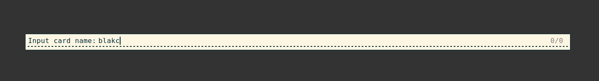
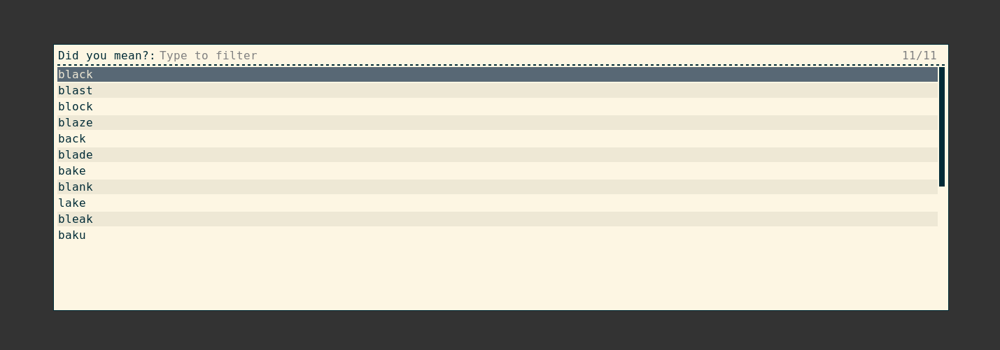
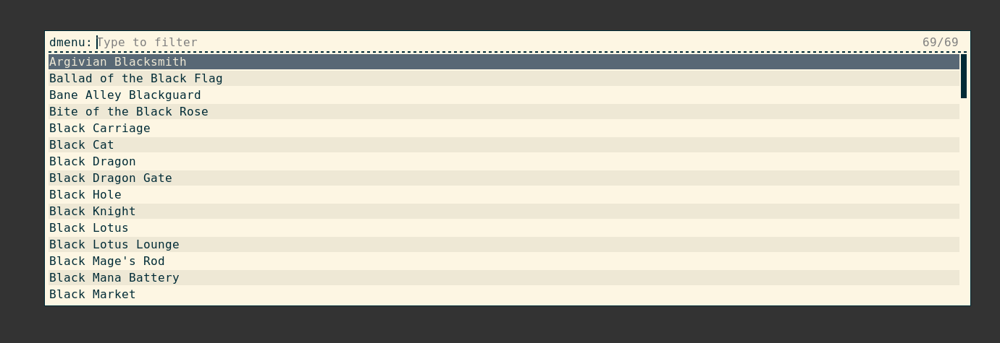
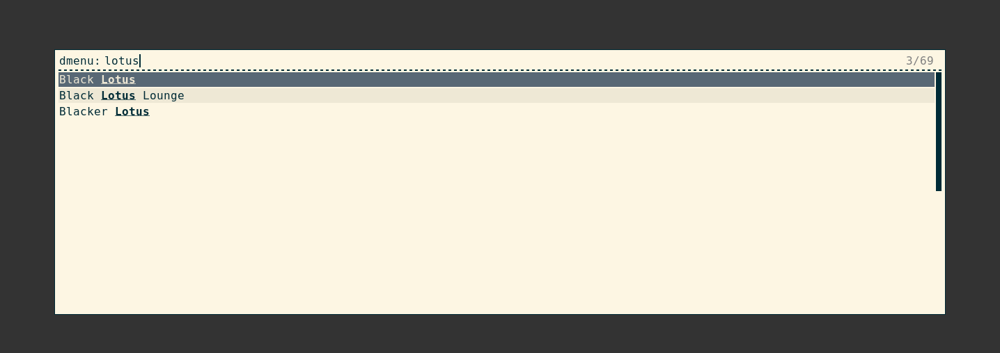
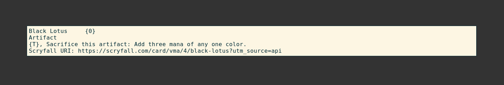

# Magic Finder

A quick way to search up Magic the Gathering (TM) cards for Linux (and maybe MacOS).

Scroll down to see how this works (with the optional `rofi` integration). No images are displayed - so don't go into this expecting that.

## The Components

This repo has 2 main parts to it:

 * `magic_finder_cli` is a command line interface for searching through cards without any GUI.
 * `magic_finder_rofi` uses [`rofi`](https://github.com/davatorium/rofi) to add some GUI stuff.

## Requirements

### Magic Finder
`magic_finder` is written in [rust](https://www.rust-lang.org/tools/install) and, as far as I know, is the only pre-requesite for insalling this. I was compiling with `rustc` version 1.88, but I would not at all be surprised if it worked on rust from year(s) ago.
 
### `rofi`
`magic_finder_rofi` requires a `rofi` version that can set the `command` setting on the `filebrowser` option. From what I can tell, this was introduced in 1.7.6, so you'll need a version at or above this.

Very annoyingly, the Ubuntu repos do *not* have this version. They have an earlier version. So, to use this, you'll need to get a more recent version yourself. I compiled and installed myself. See the end of this README for how I did that.

`rofi` works with Linux (and maybe on MacOS) but almost certainly not on Windows. For quick GUI-based search, you'll need to run Linux (or maybe MacOS). I haven't tested MacOS because I don't have access to a machine that runs it.

## Example Usage (with `rofi`)

Let's try find Black Lotus, but we did a typo. Run the `magic_finder_rofi` binary and input your typo.



Because no cards are found with the term "blakc", it'll suggest what you might've meant.



Now it'll re-do the search with the correctly spelled word (unfortunate for us "black" is a common word in magic, so we're presented with more options)



Luckily you can filter further by typing in some more words like "Lotus").



And finally hit enter or double click on the card you want to get the output you need.



## Example Usage Without Rofi

I have not coded any sort of similar "interactive" mode for the `magic_finder` tool itself. As such, you'll need to do the same steps yourself, but manually and without interactive search.

```
$ magic_finder_cli blakc
black
blast
... <SNIP> ...
```

```
$ magic_finder_cli black
Argivian Blacksmith
Ballad of the Black Flag
... <SNIP> ...
```

```
$ magic_finder_cli --exact Black Lotus
Black Lotus	{0}
Artifact
{T}, Sacrifice this artifact: Add three mana of any one color.
Scryfall URI: https://scryfall.com/card/vma/4/black-lotus?utm_source=api
```

Without exact, this tool will imitate Scryfall search and search for each individual word in the card.

```
$ magic_finder_cli Black Lotus
Black Lotus
Blacker Lotus
```

## Installation, First Usage, and Updating

### Requrements for Installation
You will at least need `rust`, so please install that before you start. Follow the insrtructions [here](https://www.rust-lang.org/tools/install).

#### Install the `magic_finder` binaries

Clone this repo and move into the directory using something like

```
git clone https://github.com/arfar/magic_finder
cd magic_finder
```

Then build and install the package.

```
cargo install --path .
```

Hopefully `cargo` has installed this somewhere that's already in `$PATH` and you should now already be able to use the binary. Run `magic_finder --help` to test.

#### Install `rofi` (optional, but preferable)
You will need a rofi version above 1.7.6.

Very annoyingly, the Ubuntu repos (as of mid 2025) do not have this version. They have an earlier version. So, to use this, you'll need to get a more recent version yourself. I compiled and installed myself. See the end of this README for how I did that.

I think rofi only works with Linux, maybe on MacOS, almost certainly not on Windows. For quick desktop-based search, you'll need to run Linux (or maybe MacOS). I haven't tested MacOS because I don't have access to a machine that runs it.

#### Install Shortcut
The real helpfulness of this tool is the ability to call this from a quick keyboard shortcut. The `magic_finder_rofi` binary is for use with a keyboard shortcut. Do whatever works with your OS.

For me on Ubuntu, I went to the `Settings` application. Then `Keyboard` > `Keyboard Shortcuts` > `Custom Shortcuts` > `+`. When adding the shortcut, provide it the location of the installed binaries (probably `$HOME/.cargo/bin/magic_finder_rofi`) and the key binding (`SUPER + s` for me).

With this set up, pressing `SUPER + s` will provide a basic `dmenu`-esque `rofi` menu where you type the card you're looking for - and you should just be off.

### Once You Install and Updating the Database
Go to the [Scryfall Bulk Download](https://scryfall.com/docs/api/bulk-data) page and download the Default Cards file. Should be aroung 500MB.

Use either:
 * `magic_finder_rofi --update` and navigate to your Oracle Cards file, or
 * `magic_finder_cli --update <LOCATION_OF_FILE>` where `<LOCATION_OF_FILE>` is where you downloaded the file to.
 
From there, it should Just Work (TM). If not, try updating this repo. If it still doesn't work, log a ticket. It's probably going to something with Scryfall updating their schema that I haven't accounted for.

NOTE: Updating *will* delete the previous db - that shouldn't be a problem though, because you shouldn't be mucking around with that that unless you really know what you're doing.

## Uninstall

Firstly, find where the database is installed using the following.

```
magic_finder_cli --database-folder
```

Delete the whole folder that is output from that command. It's probably somewhere like `$HOME/.local/share/magic_finder/`.

From within this `magic_finder` repo folder, run `cargo uninstall`. This will remove the binaries.
 
## Why this exists

I like watch Magic the Gathering (TM) videos, expecially while coding, working, writing, whatever. Often, I don't know what card they're talking about. They'll often say the card name (sometimes a nickname - this tool doesn't help with that), and show it on the screen briefly (or in a tiny/obscured view), and I'll miss what it actually does. When this happens, I need to open a tab on my browser, go to [Scryfall](scryfall.com), type in the name, (sometimes) click the specific card, and the view it. This takes 2-3 page loads, changing my active window and is just a bit of a pain.

This tool in coordination with `rofi` enables me to hit `META+S`, type in the card name, navigate to the card (if needed) with my keyboard, and display the card. No browser, no HTTP, lower context switch, instant card displayed right there, and goes away when I press anything else.

The idea is it's just easier and quicker than my normal process.

## How I Installed `rofi`
If you're smarter than me, just follow the official docs: https://github.com/davatorium/rofi/blob/next/INSTALL.md and don't bother reading this.

I am entirely unfamiliar with `meson` and `ninja` (I'm more a `Makefile` kinda guy - haven't done any `C` properly in >10 years), so here's what I did. This is for Ubutntu - you will need to do something different for downloading the dependencies (you can see them in the INSTALL.md file referenced above).

Of note below, I'm installing this into my `$HOME/bin` directory. Change that part if you want to install somewhere else. Make sure to install it somewhere in your `$PATH` though!

Clone the repo and move into it

```
git clone --recursive https://github.com/davatorium/rofi
cd rofi
```

Install the deps

```
sudo apt build-dep rofi
sudo apt install meson
sudo apt install libxcb-keysyms1-dev libxcb-keysyms1 # I suspect only one of these is needed - not sure which
```

Setup and build (not sure why I put the prefix in here... you'll see below I still copy+pasted the bin)
```
meson setup build --prefix $HOME/bin -Dwayland=disabled -Dxcb=enabled
ninja -C build -v
```

Fingers crossed that all compiled and stuff... then copy the bin

```
cp build/rofi ~/bin
```

## TODO / FIXME / Potential FEATURES / Code improvements
 * FIXME Word correction doesn't work if multiple words are provided and 1 of the words is spelled correctly
   - for example, try searching "epser origins" and you'll get questions about how to spell "origins" (which is correct) first rather than the actually incorrect word.
 * FIXME When quitting out early from `rofi` (by using Ctrl+g for example), should quit the whole program early instead of showing more useless pages I probably don't want.
 * FEATURE Do some kind of "Display All" kind of thing.
   - For example, searching "Tezzeret" gives a bunch of cards and I'm not sure which one I want (other than probably the type - but there's still a bunch of Planeswalkers)
 * FEATURE Make the Scryfall URI (L?) clickable in `rofi`.
   - Optionally, put the Scryfall URI into the clipboard.
   - Double optionally, provide some kind of `xdg-open <SCRYFALL_LINK>` sort of thing.
   - I don't think this is actually possible with `rofi`.
 * FIXME If 2 "different" but the "same" cards have the same name, the display is kinda fucky (see "Vibrant Cityscape") and it's listed twice
 * FIXME There's something wrong with the oracle text for the new cards. (see "Luis" or "Egrix", the refer to "Morlon" and "Gwenom" incorrectly).
   - This is a problem with the Scryfall API - it returns the Gwenom language. Won't fix here.
 * FIXME If no card misspellings options are available, just exit with error (try searching "avoidance")
 * FEATURE For misspelled cards, if only 1 hit that makes sense, could just work and/or provide the specific card alongside the other spellings
 * IMPROVEMENTS Add more tests and improve the ones in `deser.rs`
 * IMPROVEMENTS Reduce `deser.rs` to only relevant key:value pairs or seperate into different repo/module entirely. It could maybe be useful for others.
 * FEATURE Add some classic nicknames. Examples include:
   - Bob -> Dark Confidant
   - AK -> Accumulated Knowledge
   - find more here: https://mtg.wiki/page/List_of_Magic_slang/Card_nicknames
 * FEATURE Display images (almost certainly won't implement this).
 * FIXME There are some cards with the same name (e.g. The Superlatorium and B.F.M) which are listed more than once.
   - Don't think I will fix this... how often are you searching for this anyways?!?

## Thanks

This project really is just 95% based on Scryfall. They're amazing. I don't know how or why they exist, but I think they're basically the best Magic the Gathering (TM) resource online.

Of course `rofi` for providing the quick, simple, low-weight, and well documented tool. Particularly the quickness and low-weight which made it really possible. The alternative was opening terminal windows, or using TKinter or something... surely not worth it.

Thanks to all the amazing `rust` packages I use.
